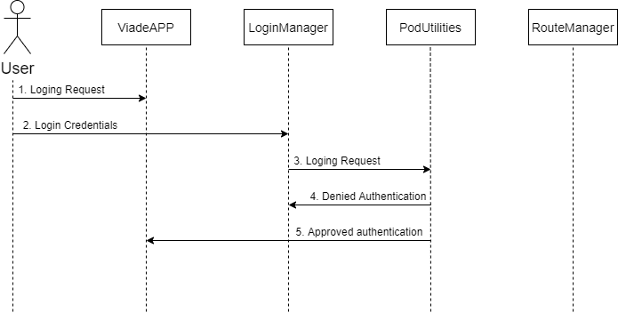

[[section-runtime-view]]
== Runtime View
In this section, we will develop the main runtime views of use cases of our application.

== Log in
Users must log in with their credentials in order to access the application and upload their data.

1. The user opens the application and accesses the page to enter their data.
2. The user enters his or her credentials.
3. Credentials are checked for accuracy.
4. The server deny the authentication.
5. The server approve the authentication.

