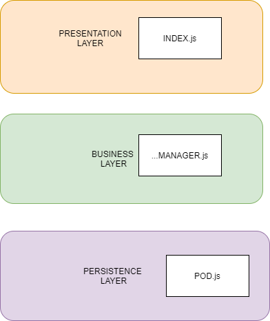

[[section-concepts]]
== Cross-cutting Concepts

=== User Experience concepts (UX)
==== User interface:
We will implement the interface using Bootstrap library because we will allow to simplify the development of the frontend. Firstly, we dedice to develop two interfaces: one is the login where a user can sign in into the app to see its routes and the other one is the page where an user can share its videos, routes...

=== Domain concepts
We have to keep in mind that is a little diagram because we haven´t got enough knowledge about the project and we are thinking about the best way to develop it. This is the first idea we have but this domain model will grow during the development of the application.

=== Design patterns
We analyzed this section in depth in the future when we will be developing the application and we realize that we need design patterns to improve our code or to simplify it. 

=== Architectural pattern
Something we are sure about is the arquitecture of our project. We are going to work with two arquitectural patterns: n layers pattern and MVC pattern. These patterns will allow us to develop a maintainable and scalable application. 
On the one hand, we want to use 3-layers pattern. This pattern will allow to separate the presentation of the application, business where we have the logic and the persistence which in our case we will store the information of each user in its pod.

In addition, we are using React js to develop viade that also have its patterns. Content-container pattern is one of the React´s pattern and it consist on divide the component into two components: one component is responsible for obtaining the information - the container - and another component shows the information that is passed through its properties - the content. 

=== Development concepts
We have to develop this application using React js and architecture SOLID. Moreover, we want to use Bootstrap library to simplify the design of the frontend. The app must meet the requirements so we are testing with diferent tools but we have not decided yet. 

=== Security concepts
Today, the development of secure applications is one of the most important points. Therefore, our app is based on SOLID architecture so each user will identified itself with a WebId and it will deal with it personal data.  
